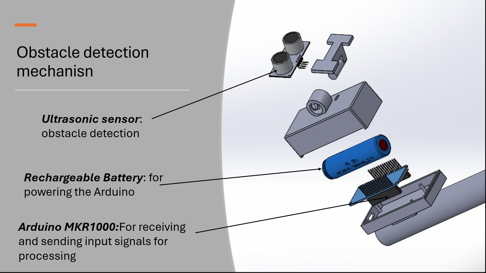
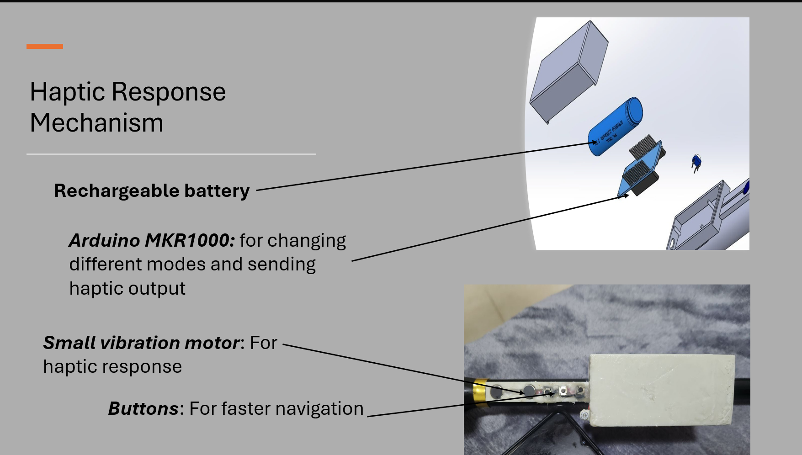

# SAGE: Smart Assistive Guidance Equipment

SAGE is a comprehensive assistive technology system designed to empower visually impaired individuals by providing real-time environmental awareness. It combines mobile computing power with distributed hardware sensors to offer object detection, obstacle avoidance, and haptic/audio feedback.

## 🌟 Core Features

-   **AI-Powered Object Detection:** Utilizes **YOLOv11** (via NCNN) for high-performance, real-time object identification.
-   **Dual Navigation Modes:**
    -   **House Mode:** Optimized for indoor environments, identifying common household objects.
    -   **Road Mode:** Focused on outdoor safety and navigation (Coming Soon).
-   **Distributed Hardware Integration:**
    -   **ESP32-CAM Support:** Can use an external wireless camera for a "glasses" form factor, discovered automatically via mDNS.
    -   **Active Obstacle Sensing:** Dual ultrasonic sensors monitor both front-facing and overhead obstacles.
    -   **Haptic & Audio Alerts:** Immediate buzzer feedback for physical dangers and Text-to-Speech (TTS) for object identification.
-   **Physical Control Interface:** A dedicated button module allows for mode toggling, triggering specific searches, and emergency assistance without needing to touch the phone screen.
-   **Safety First:**
    -   **Emergency Call:** A quick double-press on the physical interface initiates an emergency call.
    -   **Configurable Thresholds:** Users can adjust distance safety margins directly from the app.

---

## 🛠️ Hardware & Integration

The SAGE system is built on a modular hardware architecture designed for reliability and ease of use.

### 1. Obstacle Detection System

The obstacle detection module utilizes dual ultrasonic sensors to create a safety perimeter around the user. It specifically monitors:
- **Frontal Obstacles:** Detecting objects in the direct walking path.
- **Overhead Hazards:** Identifying low-hanging branches, signs, or doorways that might be missed by traditional canes.

### 2. Hardware Integration Method

Integration is achieved through a distributed TCP/IP network. The Android device acts as the central hub, managing data flows between the ESP32-CAM (visual input) and the Arduino-based sensors and actuators (physical feedback).

### 3. Convenient User Interface & Haptic Response

Designed for accessibility, this module provides:
- **Tactile Control:** Three physical buttons allow the user to toggle modes, trigger searches, or call for help without interacting with a touchscreen.
- **Haptic Feedback:** A high-frequency buzzer provides immediate, intuitive alerts when obstacles are detected within the safety thresholds.

---

## 🏗️ System Architecture

The system operates as a distributed network of devices communicating over a local Wi-Fi network:

1.  **Android Application (The Brain):**
    *   Hosts a **TCP Server** (Port 8080) to coordinate hardware modules.
    *   Performs NCNN-accelerated inference on video frames.
    *   Manages user settings, TTS announcements, and navigation logic.
2.  **ESP32-CAM (The Eye):**
    *   Streams MJPEG video over HTTP (Port 81).
    *   Advertises itself via mDNS for seamless "zero-config" connection to the app.
3.  **Ultrasonic Module (The Shield):**
    *   Uses an Arduino with Wi-Fi to monitor distances.
    *   Sends "DANGER" or "SAFE" signals to the Android app based on real-time distance measurements.
4.  **Button/Buzzer Module (The Interface):**
    *   Captures physical button presses (Single/Double press logic).
    *   Receives "BUZZ" commands from the app to provide tactile alerts.

---

## 📁 Hardware Sketches

The `SAGE` repository includes critical firmware for the hardware components:

-   **`esp32_camera_sketch/`**: Configures the ESP32-CAM for low-latency video streaming and mDNS advertising.
-   **`ultrasonic_sketch/`**: Firmware for the Arduino-based distance sensor. It handles threshold logic and TCP communication with the Android host.
-   **`arduino_sketch/buzzer_test.ino`**: (Acting as the primary Interface Sketch) Manages the physical buttons for app control and the buzzer for haptic alerts.
-   **`ultrasonic_sketch/buzzer_test.ino`**: Test utilities for hardware validation.

---

## 🚀 Getting Started

### Prerequisites
-   **Android:** Android 8.0+ (Oreo) or higher.
-   **Hardware:** 
    -   ESP32-CAM (AI-Thinker model).
    -   Arduino with Wi-Fi (e.g., MKR1000 or similar supporting `WiFi101`).
    -   Ultrasonic sensors (HC-SR04 or similar).
    -   Passive/Active Buzzer and physical push buttons.

### Installation
1.  **Android App:** Open the `SAGE` root folder in Android Studio and deploy the `app` module to your device.
2.  **Hardware:**
    *   Update the `ssid` and `pass` in the `.ino` sketches to match your local Wi-Fi.
    *   Update the `serverIP` in the Arduino sketches to match your Android device's local IP (visible in the app's Settings).
    *   Upload the respective sketches to your ESP32 and Arduino boards.

---

## 🛠️ Tech Stack
-   **Mobile:** Kotlin, Jetpack Compose, CameraX.
-   **AI Inference:** NCNN Framework, YOLOv11.
-   **Hardware:** C++ (Arduino/ESP32), TCP/IP Networking, mDNS/DNS-SD.

---

## 🧠 Detection Models

The project includes specialized NCNN-optimized models:
-   **YOLOv11n:** General-purpose detection for House/Road modes.
-   **Crosswalk Model:** Specialized model found in `cross_walk_model/` for safe pedestrian crossing assistance.
-   **NCNN Optimization:** Models are converted and optimized for mobile deployment to ensure high FPS and low battery consumption.
